# Legend of the Square Hammer

Simple zelda-like game for Object Oriented Programming university course. Game is based on **SDL 2** library and concept of isometric RPG.

## Info
**Author:** Marek Machliñski

**Creation date:** 20.04.2018

**IDE:** Visual Studio 2019

**External libraries:**
  - [SDL 2.0.14](https://www.libsdl.org/index.php)
  - [SDL_image 2.0.5](https://www.libsdl.org/projects/SDL_image/)
  - [SDL_mixer 2.0.4](https://www.libsdl.org/projects/SDL_mixer/)
  - [SDL_ttf 2.0.15](https://www.libsdl.org/projects/SDL_ttf/)

**Special code:** ^ ^ v v < > < > b a

## Screenshots
### Main menu
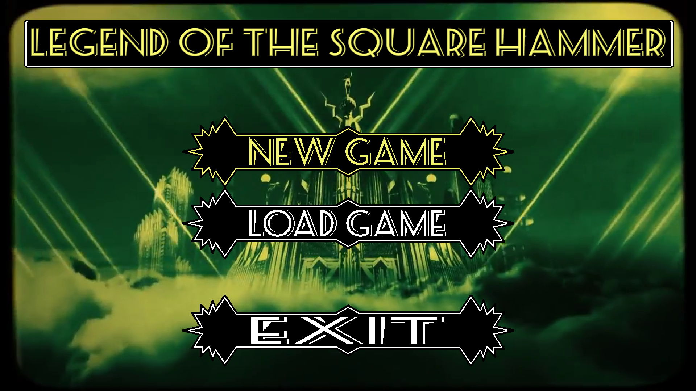

### Character creation
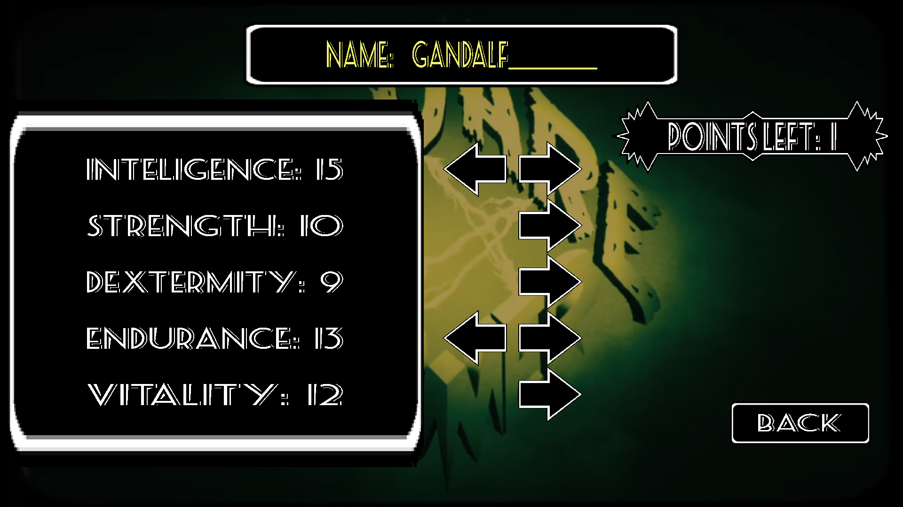

### Load menu
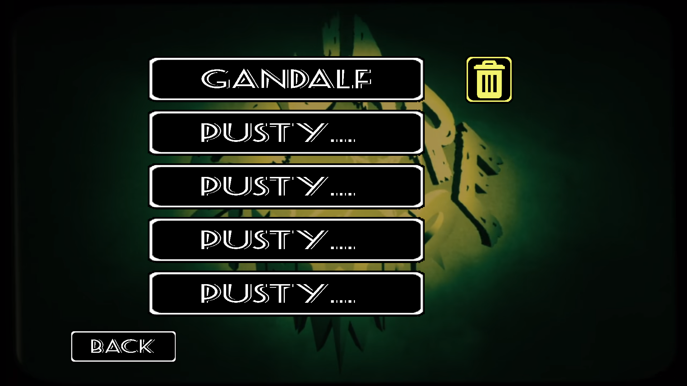

### Building on map
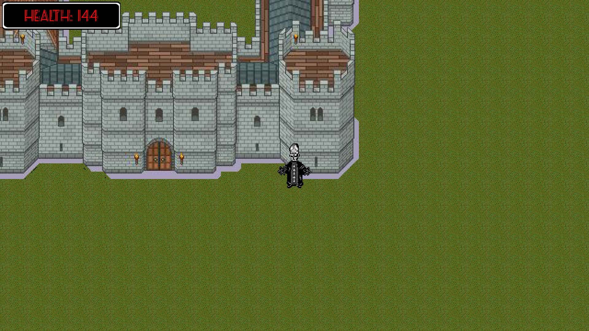

### Inside of castle
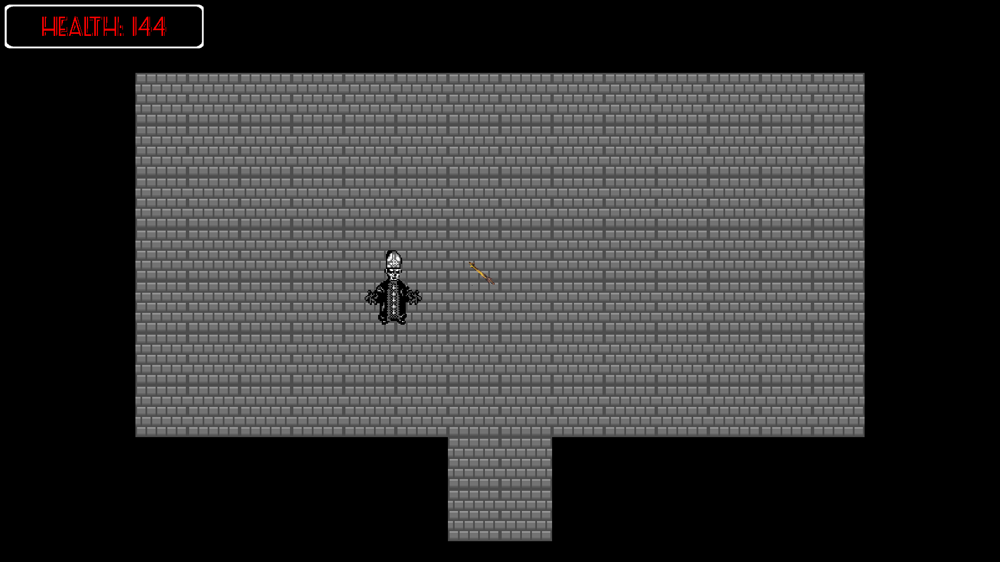

### Damage on enemy
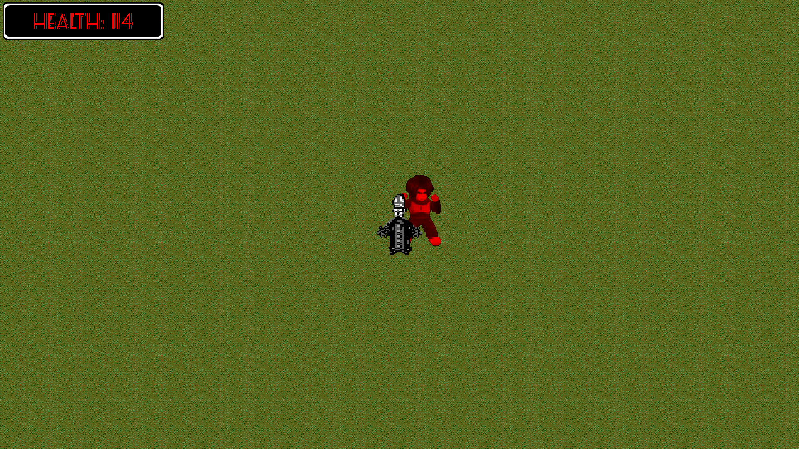

### New level acquired
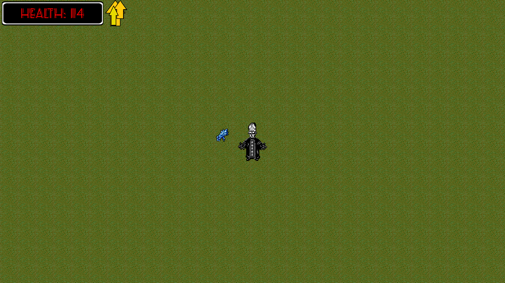

### Player inventory
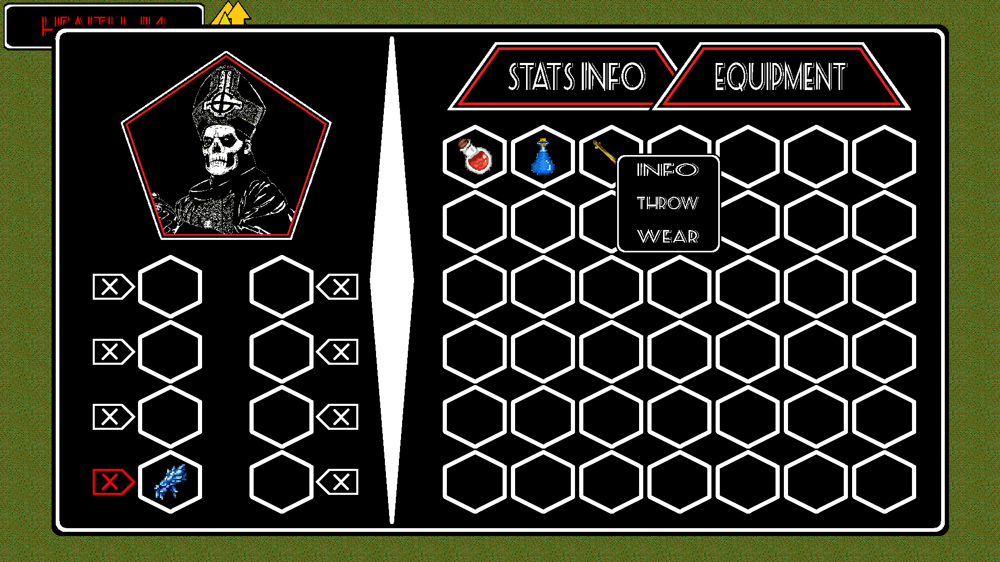

### Info about item
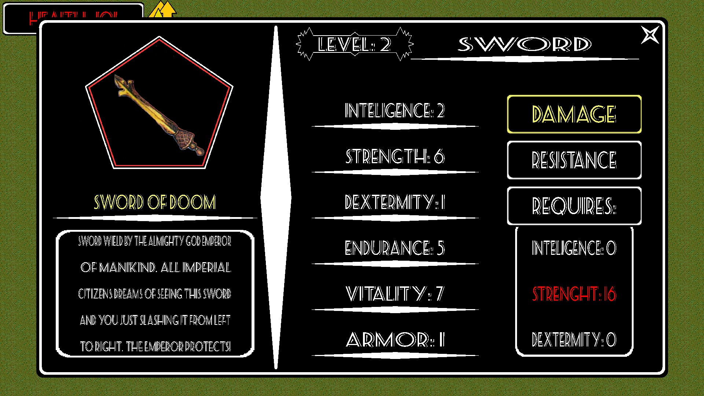

### Assigning new level points
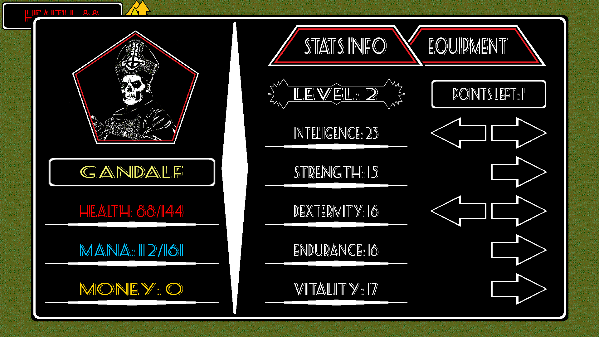

### Player statistics
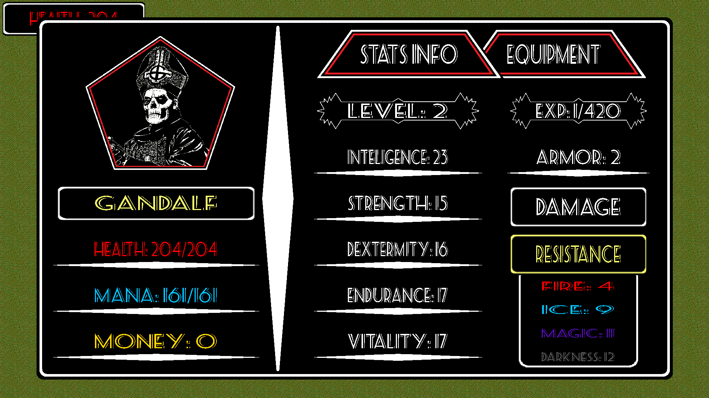

### Game over screen
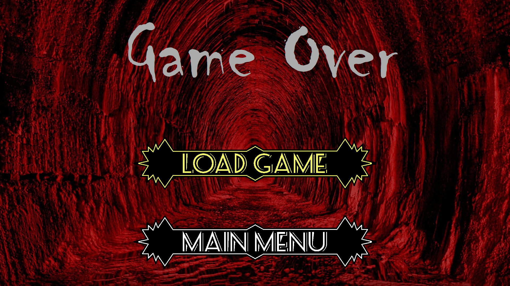

### Game over screen
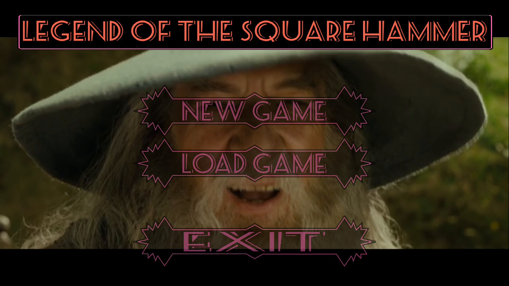